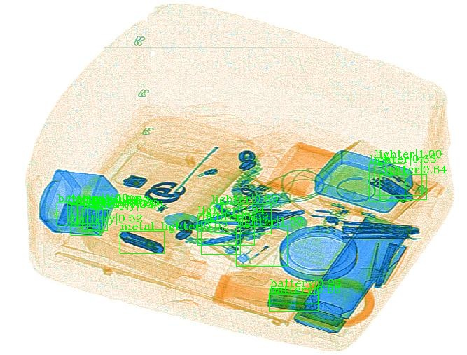
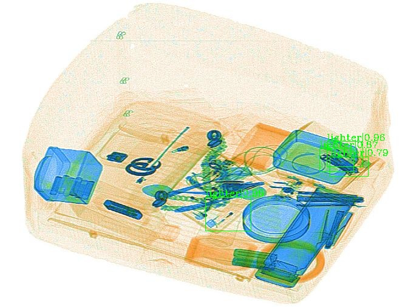

## Image IO vs OpenCV IO

在使用 kfserving 进行模型推理时， 通过二进制流的方式从网页端直接读取图片进行推理，发现最后的结果与
使用 opencv 处理的结果相差很大。

### 使用 mmdetection 默认的方式


```python

config_file = 'configs_my/faster_rcnn_r50_fpn_1x.py'
# download the checkpoint from model zoo and put it in `checkpoints/`
checkpoint_file = 'work_dir/epoch_11.pth'

# build the model from a config file and a checkpoint file
model = init_detector(config_file, checkpoint_file, device='cuda:0')

# test a single image
img_file = 'demo/xray/0.jpg'
result = inference_detector(model, img_file)
# show the results
show_result(img_file, result, model.CLASSES, score_thr=0.5, out_file='demo/xray/0_pred_1.jpg')
```




### 使用 IO 二进制流方式
```python
config_file = 'configs_my/faster_rcnn_r50_fpn_1x.py'
# download the checkpoint from model zoo and put it in `checkpoints/`
checkpoint_file = 'work_dir/epoch_11.pth'

# build the model from a config file and a checkpoint file
model = init_detector(config_file, checkpoint_file, device='cuda:0')

# test a single image
img_file = 'demo/xray/0.jpg'
img_bytes = open(img_file, 'rb').read()
img = Image.open(io.BytesIO(img_bytes))
inputImg = np.asarray(img).astype(np.uint8)

result = inference_detector(model, inputImg)
# show the results
show_result(img_file, result, model.CLASSES, score_thr=0.5, out_file='demo/xray/0_pred_1.jpg')
```




### 二进制流转 OpenCV

```python
config_file = 'configs_my/faster_rcnn_r50_fpn_1x.py'
# download the checkpoint from model zoo and put it in `checkpoints/`
checkpoint_file = 'work_dir/epoch_11.pth'

# build the model from a config file and a checkpoint file
model = init_detector(config_file, checkpoint_file, device='cuda:0')

# test a single image
img_file = 'demo/xray/0.jpg'
img_bytes = open(img_file, 'rb').read()
img_np_arr = np.frombuffer(img_bytes, np.uint8)
inputImg = cv2.imdecode(img_np_arr, cv2.IMREAD_COLOR)
result = inference_detector(model, inputImg)
# show the results
show_result(img_file, result, model.CLASSES, score_thr=0.5, out_file='demo/xray/0_pred_2.jpg')
```


